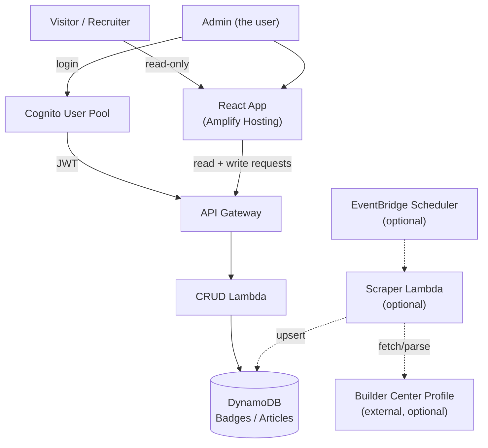

# Builder Badge Board — Architecture

Full technical detail. See `PRD.md` for product requirements and the build
plan; see `CHALLENGE.md` for the AWS challenge rules this is built against.

## Infra-as-code

**Decision: AWS SAM.** Lambda functions, API Gateway routes, and the two
DynamoDB tables are defined in a `template.yaml` SAM template and deployed
via `sam build` / `sam deploy`. Reasons:
- Purpose-built for serverless CRUD stacks (Lambda + API Gateway + DynamoDB)
  like this one.
- Reproducible and version-controlled, unlike console-clicking.
- Smaller learning curve than raw CDK for someone new to AWS, while still
  weekend-sized.

Amplify Hosting (frontend) and the Cognito user pool are the two pieces not
covered by the SAM template — see their sections below for why.

## AWS Services

| Service | Role in this system |
|---|---|
| **Amplify Hosting** | Builds and hosts the React frontend, connected to a GitHub repo for CI/CD on push. |
| **ACM (via Amplify)** | Custom domain (`builder.minkim26.tech`) for the Amplify app. The domain is registered at a third-party registrar, not Route 53, so it's managed externally — DNS records (cert validation + subdomain CNAME) are added manually at the registrar. Amplify's domain management provisions the ACM cert automatically once those records are in place. |
| **Amazon Cognito** | Single-user admin auth. One user pool, one user created manually in the console — no signup flow. |
| **API Gateway** | HTTP API in front of the Lambda functions; public routes are open, admin (write) routes require a valid Cognito JWT. |
| **AWS Lambda** | CRUD handlers (list/add/update/delete badges and articles) behind API Gateway. Defined and deployed via the SAM template. |
| **DynamoDB** | Two tables, `Badges` and `Articles` — see `PRD.md` Data Model. |
| **EventBridge Scheduler** *(conditional)* | If the scraper investigation (see `PRD.md`) turns up a viable endpoint, triggers a scraper Lambda on a schedule (daily or ~12h). |
| **Amazon Bedrock / Nova** *(stretch, optional)* | Generates a short AI summary of the user's builder journey from badge data. Not required to qualify for the challenge. |

## Architecture Flow

Public read paths and the admin write path share the same API Gateway + CRUD
Lambda layer; the difference is whether the request carries a valid Cognito
JWT. The scraper path (dashed, optional) is entirely separate and only
writes to DynamoDB — it never goes through API Gateway.

## Auth Flow (Cognito)

1. One Cognito user pool, one user, created manually in the AWS Console —
   no self-registration is implemented or exposed.
2. The React app's admin view presents a login form (Cognito Hosted UI or
   Amplify Auth SDK — either is fine, pick whichever is less setup) that
   authenticates against the user pool and receives a JWT.
3. The JWT is attached to write requests (add/update/delete) sent to API
   Gateway.
4. API Gateway uses a Cognito authorizer on the write routes only; public
   GET routes (list badges, list articles) have no authorizer and are open
   to anyone.
5. There is no role/permission tiering beyond "authenticated admin" vs.
   "anonymous visitor" — a single user pool member is implicitly the only
   admin.

## Data Flow

**CRUD path (public reads + admin writes)**
1. Frontend calls API Gateway (`GET /badges`, `GET /articles` — public;
   `POST`/`PUT`/`DELETE` — admin, JWT required).
2. API Gateway invokes the corresponding Lambda handler.
3. Lambda reads/writes the `Badges` or `Articles` DynamoDB table directly
   via the AWS SDK.
4. Response returns through API Gateway to the frontend.

**Scraper path (conditional on investigation outcome — see `PRD.md`)**
1. EventBridge Scheduler triggers the scraper Lambda on a fixed schedule.
2. Lambda fetches the builder profile — either a discovered internal JSON
   endpoint, or server-rendered HTML parsed with Cheerio.
3. Lambda transforms the response into badge/article records and upserts
   them into DynamoDB.
4. No interaction with API Gateway or the frontend — this path only ever
   writes to the same tables the CRUD path reads from.

If the investigation concludes a scraper isn't feasible this weekend, this
path is not built, and all writes to DynamoDB come from the admin CRUD path
instead.
