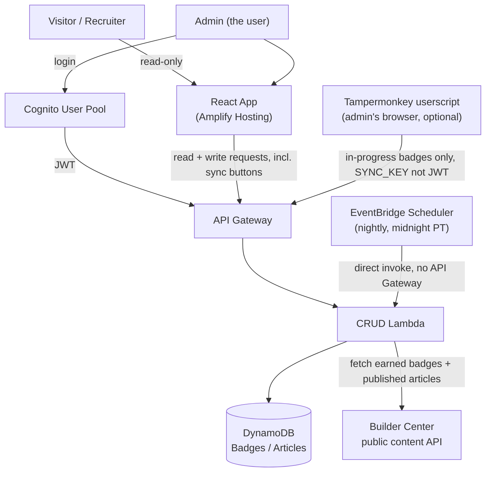

# Builder Badge Board — Architecture

Full technical detail. See `PRD.md` for product requirements and the build
plan; see `CHALLENGE.md` for the AWS challenge rules this is built against.

## Infra-as-code

**Decision: AWS SAM.** Lambda functions, API Gateway routes, and the two
DynamoDB tables are defined in a `template.yaml` SAM template and deployed
via `sam build` / `sam deploy`. Reasons:
- Purpose-built for serverless CRUD stacks (Lambda + API Gateway + DynamoDB)
  like this one.
- Reproducible and version-controlled, unlike console-clicking.
- Smaller learning curve than raw CDK for someone new to AWS, while still
  weekend-sized.

Amplify Hosting (frontend, including the webhook and GitHub secret that
trigger its builds — see [DEPLOY.md](DEPLOY.md)) and the Cognito user pool
are the two pieces not covered by the SAM template — see their sections
below for why.

## AWS Services

| Service | Role in this system |
|---|---|
| **Amplify Hosting** | Builds and hosts the React frontend. Amplify's own auto-build is off; the GitHub Actions `deploy` job triggers a build through an incoming webhook after tests pass on `main`, and only when frontend files changed. |
| **ACM (via Amplify)** | Custom domain (`builder.minkim26.tech`) for the Amplify app. The domain is registered at a third-party registrar, not Route 53, so it's managed externally — DNS records (cert validation + subdomain CNAME) are added manually at the registrar. Amplify's domain management provisions the ACM cert automatically once those records are in place. |
| **Amazon Cognito** | Single-user admin auth. One user pool, one user created manually in the console — no signup flow. |
| **API Gateway** | HTTP API in front of the Lambda functions; public routes are open, admin (write) routes require a valid Cognito JWT. |
| **AWS Lambda** | CRUD handlers (list/add/update/delete badges and articles) behind API Gateway. Defined and deployed via the SAM template. |
| **SSM Parameter Store** | Holds the `progress-sync` shared secret (a SecureString the Lambda reads at runtime) and the alert email address (resolved at deploy time), keeping both out of the repo and out of the function's configuration. |
| **DynamoDB** | Two tables, `Badges` and `Articles` — see `PRD.md` Data Model. |
| **EventBridge Scheduler** | Triggers the same CRUD Lambda directly (no API Gateway) once nightly at midnight PT, running both `syncBadges()` and `syncArticles()` against Builder Center's public content API. See Data Flow below. |
| **Amazon Bedrock / Nova** *(stretch, optional)* | Generates a short AI summary of the user's builder journey from badge data. Not required to qualify for the challenge. |

## Architecture Flow

Public read paths and the admin write path share the same API Gateway + CRUD
Lambda layer; the difference is whether the request carries a valid Cognito
JWT. The nightly sync and the two manual "Sync from Builder Center" buttons
(`POST /badges/sync`, `POST /articles/sync`) all run the same Lambda code —
the only difference is what invokes it. The Tampermonkey path is the one
exception: it covers only in-progress badges, which have no public API (see
Data Flow below), and writes through a `SYNC_KEY`-protected route instead of
a Cognito JWT, since the userscript can't do an interactive login.

## Auth Flow (Cognito)

1. One Cognito user pool, one user, created manually in the AWS Console —
   no self-registration is implemented or exposed.
2. The React app's admin view presents a login form that calls Cognito's
   `InitiateAuth` API directly (`web/src/auth.js`, no SDK) and receives a JWT.
   The pool requires TOTP MFA, so sign-in is a password followed by a 6-digit
   authenticator code, and the very first sign-in also enrolls the
   authenticator app.
3. The JWT is attached to write requests (add/update/delete) sent to API
   Gateway.
4. API Gateway uses a Cognito authorizer on the write routes only; public
   GET routes (list badges, list articles) have no authorizer and are open
   to anyone.
5. There is no role/permission tiering beyond "authenticated admin" vs.
   "anonymous visitor" — a single user pool member is implicitly the only
   admin.

## Protections and Monitoring

- **Login brute force** never reaches API Gateway (the browser talks to
  Cognito directly), so it is limited by Cognito's own throttling and lockout,
  by TOTP MFA, and by `PreventUserExistenceErrors` (an unknown username looks
  the same as a wrong password). API Gateway throttles can't help here.
- **API floods**: every route is throttled at 10 requests/second (burst 20),
  globally rather than per IP; `POST /badges/progress-sync` has its own
  tighter limit.
- **Sync key**: the shared secret for `progress-sync` is an SSM SecureString
  that the Lambda reads at runtime and caches for five minutes, so it is not in
  the template, the stack parameters, or the function's configuration. It is
  compared in constant time, and each wrong guess is logged and counted by an
  alarm.
- **Response headers**: HSTS, a CSP that allows only this site's own API and
  Cognito hosts, and clickjacking / MIME-sniffing protections are set in
  `customHttp.yml`.
- **Logs and alarms**: API access logs and Lambda logs are kept 30 days. An SNS
  topic emails the address stored in the SSM parameter
  `/builder-badge-board/alert-email` when Lambda errors (including a failed
  nightly sync), the API answers a 5xx (the handler catches most failures and
  returns 500, which the Lambda error metric doesn't count), API 4xx responses
  spike, or the sync key is guessed wrong repeatedly.
- **Data safety**: the DynamoDB tables have point-in-time recovery and are
  retained if the stack is ever deleted.

## Data Flow

**CRUD path (public reads + admin writes)**
1. Frontend calls API Gateway (`GET /badges`, `GET /articles` — public;
   `POST`/`PUT`/`DELETE` — admin, JWT required).
2. API Gateway invokes the corresponding Lambda handler.
3. Lambda reads/writes the `Badges` or `Articles` DynamoDB table directly
   via the AWS SDK.
4. Response returns through API Gateway to the frontend.

**Sync path (badges and articles, nightly + on-demand)**

Both badge and article sync call real, undocumented, unauthenticated
Builder Center endpoints — found via Chrome DevTools while browsing the
site, not published anywhere. Neither needs a real session credential, just
a placeholder `builder-session-token: dummy` header; both have zero
stability guarantee and could change or get blocked without notice. See
`PRD.md`'s Build Plan for how each was found and the tradeoffs involved.

1. Triggered either by EventBridge Scheduler (nightly, direct Lambda
   invoke, no API Gateway) or by clicking "Sync from Builder Center" in the
   admin panel (`POST /badges/sync` or `POST /articles/sync`, Cognito JWT
   required, same as any other write route).
2. `syncBadges()` calls `GET api.builder.aws.com/rms/badges?bpId=...` for
   earned badges; `syncArticles()` calls
   `GET api.builder.aws.com/cs/v2/articles/user/{bpId}` for published
   articles. Both paginate (`nextToken` / `cursor` respectively) until
   exhausted.
3. Each response item is transformed and upserted into DynamoDB, keyed by
   Builder Center's own ID (`badgeId` / `articleId`) so re-syncing is
   idempotent.
4. No interaction with the frontend either way — sync only ever writes to
   the same tables the CRUD path reads from.

**In-progress badges are the one gap neither sync path covers** — no public
endpoint returns them; the data only ever appears on a private,
logged-in-only dashboard page. Automated instead via a Tampermonkey
userscript (`tampermonkey/progress-sync.user.js`) that runs in the admin's
own browser, passively watching `fetch` responses while they browse
normally and forwarding in-progress counts to a `SYNC_KEY`-protected route
(no Cognito — the userscript can't do an interactive login). Manual entry
via the admin panel remains the fallback for whenever a matching tab isn't
open.
